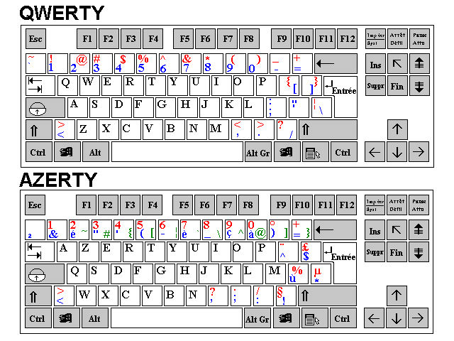

Lately i've been researching a lot about keyloggers and implementing them in C and that led me into a rabbithole that i will share with you today, but before we start i should put a disclaimer that i will over simplify things so we would understand the things needed for our Windows keylogger not the whole keyboard input mechanism
so now thats that out of the way, ever thought how keyboard handles a key input anyways?
because thats what we will be talking about starting with...

## Scan codes

Our journey starts with scan codes, you can think of a scan code as a unique identifier for the physical key on your keyboard set by the manufacturer however ever since USB happened its mostly been standardized.
Scan codes are also layout independent and hardware dependent, but what's that mean?

Whenever you press on a key on your keyboard, a scan code is sent to the OS  so lets say we pressed A in the QWERTY layout and we got the scan code `0x1E` for example.
 then we switched the layout to AZERTY in the OS settings and pressed the same key physically we will get the same code `0x1E` even though its not interpreted as the same character anymore but its the same physical key on the keyboard independent of the layout.

## VK code

## Hooks

1. add HID
2. MSg loop
3.
