Hey everyone! This challenge marks the end of the PMAT course challenges. I honestly learned a lot from this challenge, especially from the infamous WannaCry ransomware. I hope you learn as much as I did from this challenge! let's get started

[Challenge Link](https://github.com/HuskyHacks/PMAT-labs/tree/main/labs/4-1.Bossfight-wannacry.exe)

## 1. Record any observed symptoms of infection from initial detonation. What are the main symptoms of a WannaCry infection?
Well the obvious symptom that the files on the harddisk start to have a .wncry extension then after a short time you will be prompted with the famous wallpaper and the window demanding you to pay the ransom
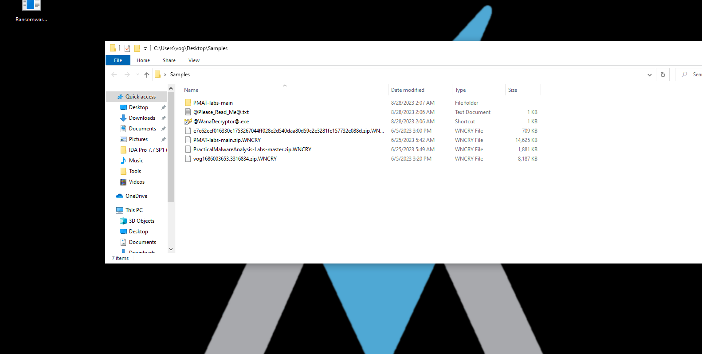
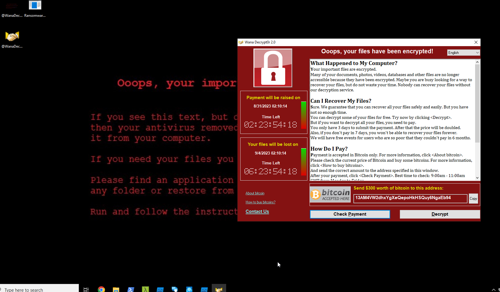
Additionally, I later noticed that DiskPart starts running when the malware is executed. It becomes apparent that it is, in fact, "tasksche" associated with the malware, running from the malware's working directory.
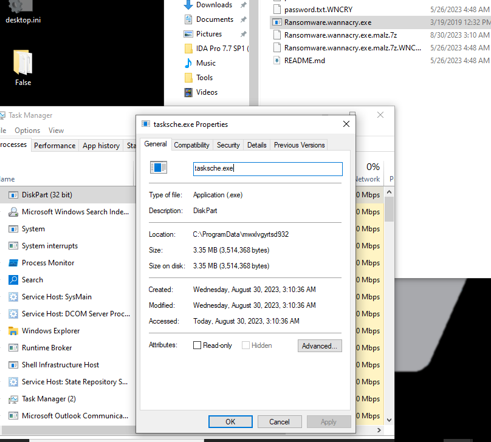
## 2. Use FLOSS and extract the strings from the main WannaCry binary. Are there any strings of interest?
We can see a couple of ip addresses in the strings and a couple of strings that could give us a hint about the used technologies in the malware like sqlite and also from the strings like the errors and C++ runtime library we can conclude its in C/C++ yet the existence of .class strings guides us towards C++
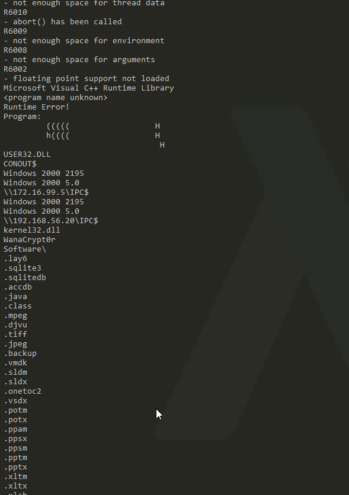
## 3. Inspect the import address table for the main WannaCry binary. Are there any notable API imports?
When checking the imports table we can see that there are imports used to connect to an URL like InternetOpenUrlA and other socket imports like [WSAStartup] that is used to initialize [Winsock] to set up sockets on the windows machine which hints that the malware has some network indicators we can look into later.
There is also some encryption functions which will be used to encrypt the data ion the hard-disk and some potential process injection functions like [CreateProcessA]
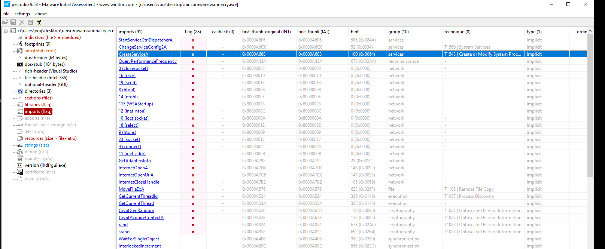
## 4. What conditions are necessary to get this sample to detonate?
When i first tried to detonate the sample it nothing happened it took me a while to figure out exactly why.
so when detonating the malware it checks if it can reach a certain domain and if it does it won't detonate and we can see that domain clearly in the next question.
It didn't detonate the first time as i was running INetSim the first time and after i shut it down it behaved like it should.
## 5. **Network Indicators**: Identify the network indicators of this malware
Checking wireshark on iNetSim while detonating the malware we can see a domain that really stands out 
iuqerfsodp9ifjaposdfjhgosurijfaewrwergwea(.)com

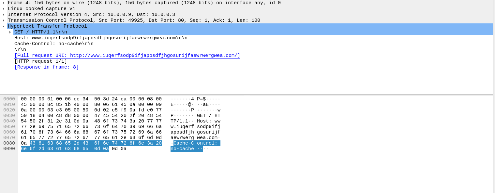

But when the malware actually detonates aka the INetSim is off and the domain above is unreachable we get a lot of traffic including lots of DNS requests generated by this malware.
First we see A LOT of arp requests trying to figure out every device on the network so it can spread and it does this in a couple of ways bet we are starting with arp
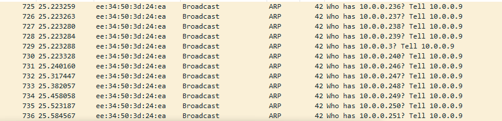
The malware also uses SSDP M-SEARCH to discover any services on the local network
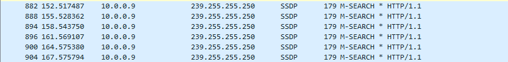

Using NBNS,MDNS and LLMNR to resolve names on the local area network
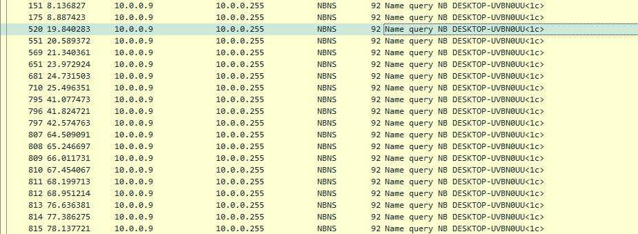
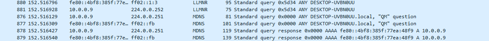

## 6. **Host-based Indicators**: Identify the host-based indicators of this malware.
While detonating the malware and running procmon to monitor any created files something stood out to me which the tasksche.exe that is created by the malware. First i tried running the malware with no admin privilege but it didn't really do anything but when i ran it as admin it detonated and we can see that it tried to create this file but got access denied until i ran it as admin
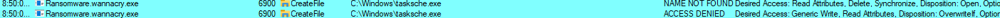
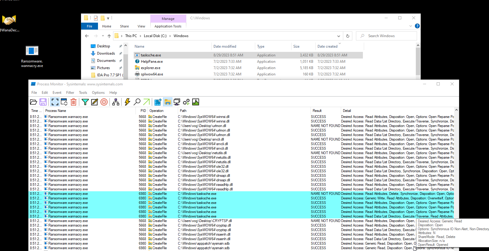

Checking the directory we notice earlier when we detonated the malware we notice the dropped files by the malware. We can see the tashsche.exe that was running as diskpart upon malware detonation and other executables.
At first i thought i missed it when i was analyzing procmon but when i tried searching for the string mwxlvgyrtsd932 in procmon nothing came up so it was probably obfuscated by the malware.

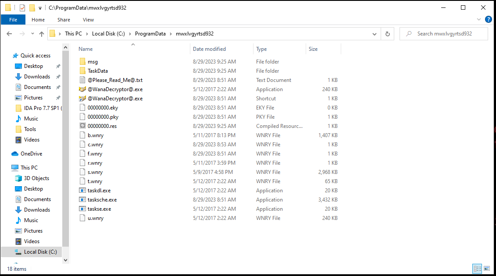

Each directory has these files
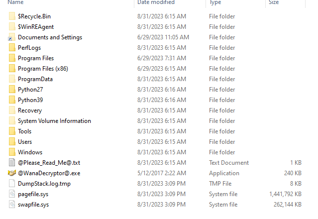

## 7. Use Cutter to locate the killswitch mechanism in the decompiled code and explain how it functions.
Now we get to the fun part. we're going to reverse engineer the malware using IDA (or cutter its just preference) to find how we can disable the malware. I have renamed some function to make it easier to follow along.

When launching the binary in IDA we'll see that it already recognizes the main function that we can find in the functions list or when scrolling down in the start function
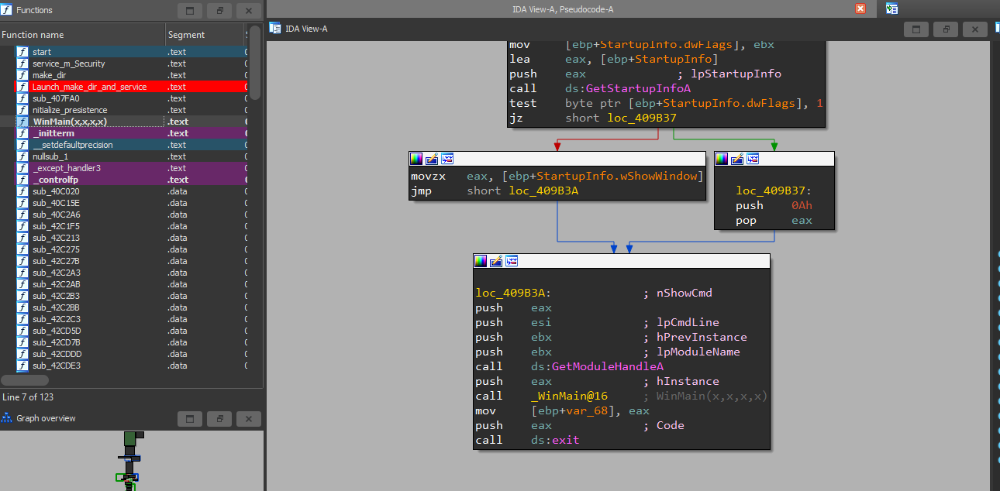

Now let's delve into the main function of the program. The first thing that catches our eye is a peculiar URL being loaded and then passed into the [InternetOpenUrlA] function. As it's evident, this function attempts to connect to a URL. If it's successful, it obtains a valid handle to the URL. If the connection is not successfully established, it returns NULL. You can read more about the arguments passed to this function in the [InternetOpenUrlA Documentation](https://learn.microsoft.com/en-us/windows/win32/api/wininet/nf-wininet-internetopenurla). I'll keep this post as concise as possible.

Next, we observe that the return value is stored in EAX, then moved to EDI. EDI is then logically ANDed with itself using test edi, edi. This operation changes the zero flag (ZF), which is checked by the JNZ (jump if not zero) instruction. This determines whether it jumps to the specified address or skips the jump entirely.

So, let's recap the flow of the code so far. We first attempt to connect to the weird URL with the InternetOpenUrlA function. If all goes well, we get the handle and store it in EDI. Then, we perform a logical AND operation on EDI and itself. If the ZF becomes 0, we will NOT take the jump, causing the program to terminate without performing any malicious activity. This is the kill switch we're looking for. Just like that, having that domain up will cripple the malware, rendering it unable to execute or encrypt any data. We can also disable the malware by changing the JNZ instruction to a simple JMP instruction, which will always jump over the malicious function that initializes the malware, as shown on the left side of the graph below. Bonus points for having the same instruction size as the JNZ instruction. 

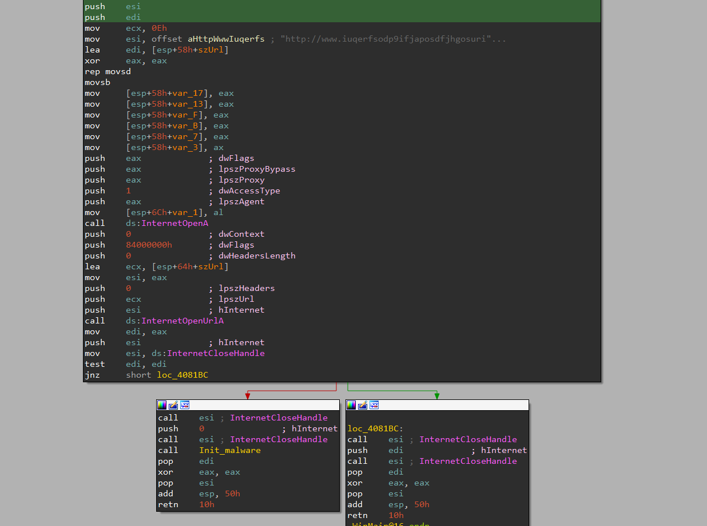
But what happens if we fail to connect to the URL, and we take the jump? Glad you asked.

If we analyze the init_malware function, we'll find out. First, it gets the file path and name using the [GetFileModuleA](https://learn.microsoft.com/en-us/windows/win32/api/libloaderapi/nf-libloaderapi-getmodulefilenamea) function, then checks the number of arguments passed. If it's more than 2, it will call a function that I've renamed to reflect its purpose (spoilers). So, let's examine that function first. However, we can conclude that the malware is probably launched more than once, as it exhibits different behaviors depending on how many arguments are supplied to it.

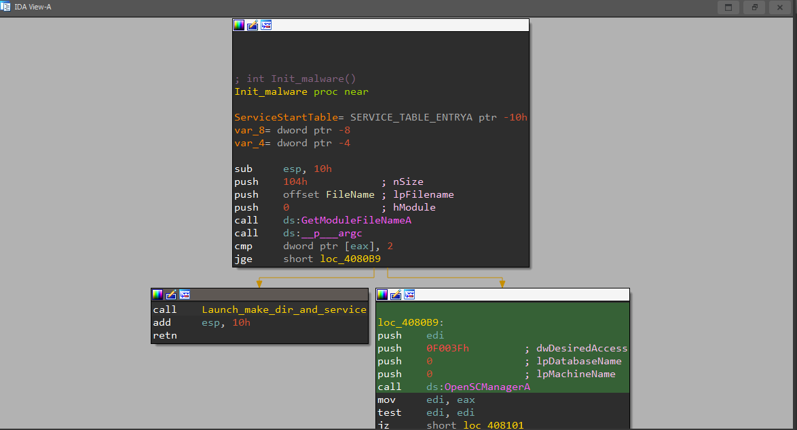

Inside the function, we see a simple call to two functions. Let's take a look at the first one.
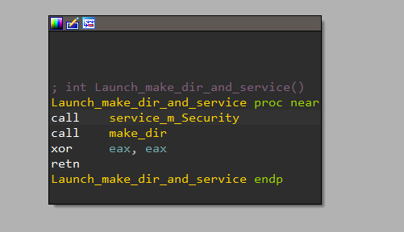

The first thing we notice is that it launches the executable with -m security arguments, and the %s placeholder is replaced with the file name and path. Then, it attempts to obtain a handle for the service manager with the highest privileges. If it succeeds, it creates a service named mssecsvc2.0 and starts the service. This is undoubtedly a malicious service masquerading as a normal service created by WannaCry. The service attempts to infect connected Windows machines on its local network using the [ETERNALBLUE exploit doublepulsar backdoor](https://www.rapid7.com/security-response/doublepulsar/)

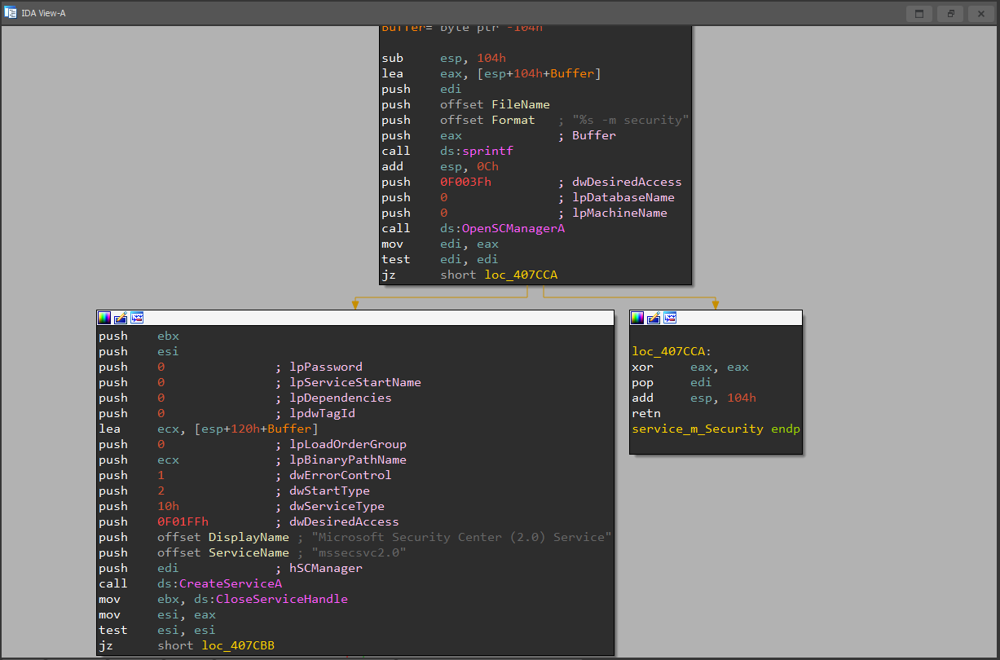

Now, let's delve into the decompiled code of the makedir function to make sense of what is happening. When looking at this function, a couple of things catch our attention. First, it uses the FindResourceA function, which is used by packed malware to store EXE or DLL files within the malware binary itself. After finding and loading the resource, it checks its size. If all goes well, WannaCry creates the directory, which we can see in the code as `C:\\%s\\qeriuwjhrf`. The %s placeholder will be replaced with the file's path leading to the directory. The dropper then extracts the encrypter binary from its resource (R/1831), writes it to the hardcoded filename \tasksche.exe, and then executes it.
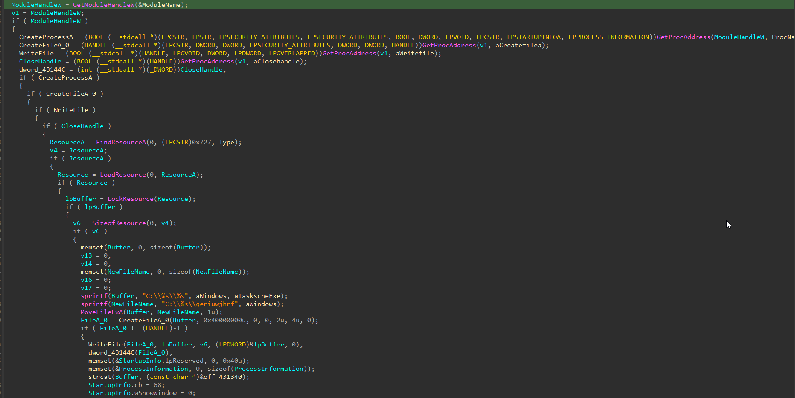

That's all for today. In the upcoming part, I will provide a more detailed analysis of tasksche.exe. We have already uncovered valuable insights into the behavior and inner workings of WannaCry, but there is still much more to explore. Thank you for your continued interest and attention to detail as we unravel the complexities of this malware. Stay tuned for the next part!