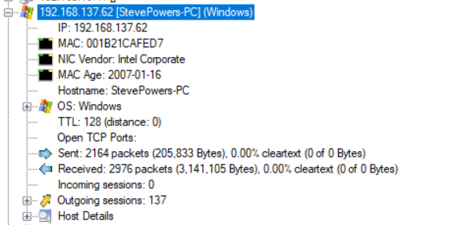
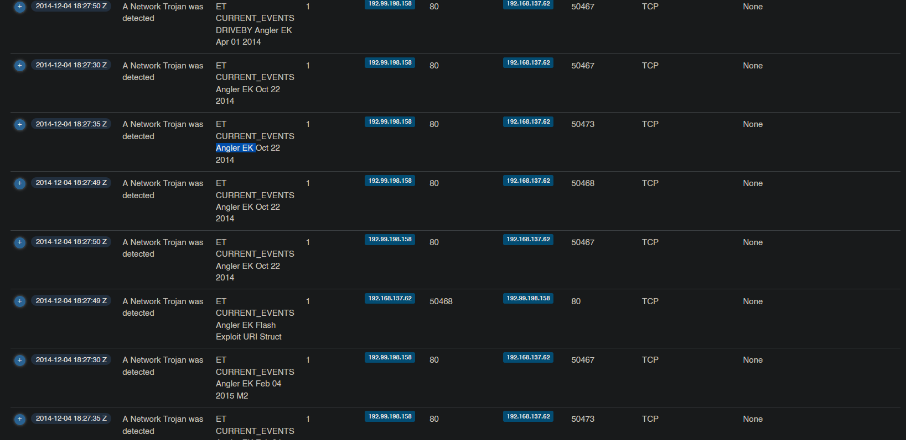
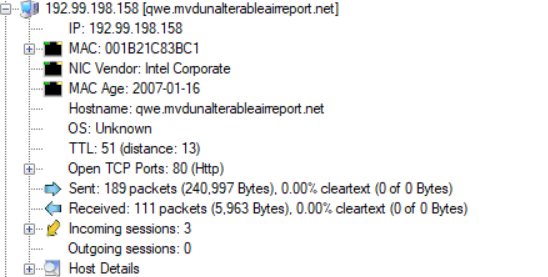

# Malware Traffic Analysis 3

Created: May 25, 2023 3:46 PM

The Malware traffic analysis challenge aims to detect the malicious payload and gather the correct information about it to take necessary procedures. Analyzing network traffic and identifying security threats is a huge key to detect and respond to attacks. It also helps in understanding the techniques used by attackers, which in itself helps in setting up better security measures and policies.

Remember to try this challenge on your own first and really give it your hardest, it was challenge to be honest but there is a lot to learn from it.
Tools:

1. Wireshark
2. NetworkMiner
3. Packettotal
4. VirusTotal

## 1. What is the IP address of the infected Windows host?

So there are a couple of ways to answer this question.
We can usr NetworkMiner to get an overview of the pcap file

Here we can see that the only windows host on our hosts list has an IP of ***192.168.137.62***
Additionally we can open Wireshark and analyze for the HTTP traffic by simply typing the protocol name `http` or  `tcp.port== 80` . We will notice that there a lot of HTTP traffic for that IP address.

Obviously, those are not concrete signs that the machine is indeed infected but we will do further investigation but when dealing with a bigger network doing a manual analysis like this wouldn't be the most efficient option usually IDP/IPS like snort are used to alert the analysist for suspicious behavior and its up to the analysist to conduct more investigation to confirm the alert or flag it as a  false alert.

## 2. What is the Exploit kit (EK) name? (two words)?

We can notice there are a lot of files from 72.125. * . * and turns out those are google servers( youtube, fonts.google etc..).
After using [https://packettotal.com](https://packettotal.com/) to scan the packet for any malicious file (in this case EK) it came up with ***Angler ek***

## 3. What is the FQDN that delivered the exploit kit?

This will be easy because we already know the attacker’s IP address which is 192.99.198.158. So opening up NetworkMiner and checking the host list for the IP address we can see the host name is [qwe.mvdunalterableairreport.net](http://qwe.mvdunalterableairreport.net/)

This can be done with Wireshark by adding a column with whatever name and selecting custom, then edit column then adding `[http.host](http://http.host)` in the field below.

## 4. What is the redirect URL that points to the exploit kit landing page?

To answer this question what i personally like to do is to sort the packets by the oldest so i can see the flow of the traffic and when did things go wrong.

Normal user traffic

As we can see at first things seem very normal and nothing out of the ordinary. but as we keep watching the traffic things get interesting.

Suspicious traffic

So here the victim gets redirected from an infected legitime website to a site called adstairs then is redirected again to another site in which the victim sends a post request with 3 parameters -which can be used for a lot of malicious reasons- but in this context it can be used to fingerprint the user. one of them is obviously the IP address but the keys are encoded 

Post request info.

After some more redirections we bump into the attackers website and when checking the referrer we can see the answer to the question

## 5. What is the FQDN of the compromised website?

As we mentioned in the first screenshot in the last question the infected website is [***earsurgery.org***](www.earsurgery.org)

## 6. Which TCP stream shows the malware payload being delivered? Provide stream number

Wireshark uses a unique number to identify TCP traffic between 2 sockets.

For example, any traffic between socket A  (192.168.137.62, port: 50473) & socket B (192.99.198.158,port: 80) will have a unique steam number and lets assume its 63. If the TCP connection is terminated, the stream number can not be used again.

So lets find the real stream number, We already know that this stream number is uniquely used between the attackers that is delivering the payload to the victim, so we don't really need to change our filters or strategy since we were already inspecting that traffic.

We can check the stream number (steam index) by selecting the packet from the site that delivered the EK, then checking the details under the transmission control protocol (TCP) in the transport layer. We’ll find that the stream number is ***80.***

## 7. What is the IP address of the C&C server?

Now we need to check the DNS traffic after the victim downloads the malware to see the address of the C&C server that the malware is reporting to on behalf of the user.

We can also check http traffic but usually malware may use other protocols and may encrypt the traffic, but by Monitoring the DNS request we can detect suspicious request and check them for domains that are associated with malware.

Adding `udp.port ==53` or simply typing `dns` in the filter bar in Wireshark will give us a hefty list of DNS requests and responses.

We can start by looking for the DNS response for the attackers website as the user was not infected before.

Here it is, but wait, there are some very sketchy DNS requests after visiting the attacker's website. Yet, they mostly are mostly unreachable by the DNS server. This keeps going until we finally get a response including the IP address of one of those sketchy domains. IP = ***209.126.97.209***.

## 8. What is the expiration date of the SSL certificate?

We can check the expiration date of the SSL certificate on PacketTotal by going to the SSL certificates tab and filtering the results using the IP address we obtained from the previous question.

Then we can download the certificate and check by expiry date but make sure to change the file extension to .cer first. ans: ***24/11/2024***

## 9. The malicious domain served a ZIP archive. What is the name of the DLL file included in this archive?

To make this easier, I filtered the packets to `ip.src==192.99.198.158 && http || ip.dst==192.99.198.158 && http`, so we can see all the traffic the malicious domain is involved in.

When investigating the filtered packets, I came across a text/html packet that has the archive we are looking for. By extracting the packet bytes and uploading it to VirusTotal...

we can indeed see that that is the archive we are looking for. upon further inspection we can see in the bundled files the .DLL file we are hunting.

Another way to do this is to use binwalk 

`

Binwalk searches for file signatures to locate and identify executable files, filesystem images, compressed archives… Find more [here](https://www.thegeekdiary.com/binwalk-command-examples-in-linux/)

## 10. Extract the malware payload, deobfuscate it, and remove the shellcode at the beginning. This should give you the actual payload (a DLL file) used for the infection. What's the MD5 hash of the payload?

What we can understand from that question is that the payload consists of a shell code and then the actual payload, which is a .DLL file type. So we first need to extract the whole payload, deobfuscate it, figure out where the shell code is, and then we would have the .DLL payload file from which we can get the MD5 hash.

Now when analyzing the other file that was sent from the infected website we come across another file.

And scanning this file on virus total gives that it is indeed the payload.

So lets analyze this, there are a couple of tools to do this but ill analyze it with Okteta.

After exporting the file from Wireshark run `okteta <filename>` 

We can notice 2 things here:

1. the payload is partially encrypted
2. there is this phrase that is repeated a lot. adR2b4nh

Honestly i had no idea where to start decrypting the payload, so i googled a lot and i stumbled upon common encryption methods for the angler EK such as XOR and when doing more research i discovered that When using a key that is smaller than the string, there will be some characters that will pop up more frequently than others in this case adR2b4nh

So, using Cyberchef and handing in the file as input we can decrypt the file with the key and download it.

Our next step is to extract the .DLL file from the obfuscated payload and we can use Binwalk for that verify the file type then get the MD5 hash

We can verify by uploading the PE file to Virustotal

 

## 11: What were the two protection methods enabled during the compilation of the PE file? (comma-separated)

This one required a quite a bit of research as i wasn't that familiar with PE files before solving this question and needed to understand the file structures.

So there are two ways to solve this:

1. Google searching and reading about security mechanisms
2. Using PEV on kali (partial answer)

I did do both honestly. I started with research and learning about the different methods like ASLR, Stack Cookie and DEP…

Then i submled upon [prev](https://www.kali.org/tools/pev/) and i used it to check for the protection mechanisms in the PE file

using `pesec 591`

So we have SEH and stack cookies enabled. Using the answer field and a hint, we can see that the first letter is indeed "S" in one of the two mechanisms, but we have a word ending with "y" in the other. I was lost for a bit and started reading some write-ups to use them as a hint, and I discovered that there is another name for stack cookies, which would be the answer.

So I started doing more research on stack cookies. I stumbled upon [this](https://security.stackexchange.com/questions/20497/stack-overflows-defeating-canaries-aslr-dep-nx) Security Stack Exchange question about defeating canaries. Reading about canaries, they do exactly what stack cookies do.

**Stack cookies** work by setting a global variable in the code and checking this value before the function exits. If the return value doesn't match the original value, then the program is terminated or calls an exception. This can be used to detect buffer overflows, such as overwriting the function’s return address.

Note: The canary is done by the compiler, not the PE file itself.

**SEH**, on the other hand, is the Structured Exception Handling. It is simply code that runs when the program throws an exception due to a hardware or software issue. This means catching those situations and doing something to resolve them.

## 12: When was the DLL file compiled?

A quick visit to virus total should tell us

## 13: A Flash file was used in conjunction with the redirect URL. What URL was used to retrieve this flash file?

Going back to Q4 The user got directed to adstairs so filtering this website

We see 

adstairs.ro/544b29bcd035b2dfd055f5deda91d648.swf

## 14: What is the CVE of the exploited vulnerability?

again searching and searching till i found this great [article](https://www.trendmicro.com/vinfo/nz/security/definition/exploit-kit) explaining the CVE

## 15: What was the web browser version used by the infected host?

From the article the CVE was affecting internet explorer version 6-10.

A quick glance in wireshark would tell us it was version 9. We can check it out in the HTTP request.

## 16: What is the DNS query that had the highest RTT?

By typing dns as a filter, going to view→  time display format and changing it to seconds since previous displayed packet, then sorting the results with the highest time we can get an estimate of the highest RTT but if we change back the time and check the difference between the DNS query and response we will find out that the first one doesn't have the highest difference but its packet number 77 that does.

Maybe there’s an easier way to do this but that's how i did it.

## 17: What the name of the SSL certificate issuer that appeared the most? (one word)

Using network miner and opening the files tab and sorting them by extension we see a lot of .cer files and we can just by eying it conclude that google has a huge number of certificates captured in this pcap file

And that’s a wrap. This challenge had some difficult moments for sure mostly because i stepped into unfamiliar grounds.

Thank you for reading this far! Stay safe :D